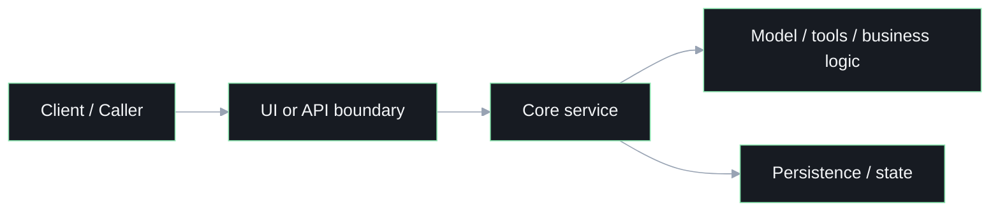

<!-- _class: lead -->

Architecture Review

# Architecture Overview

## Repo / System Name

- audience
- scope
- the main architectural question this deck answers

---

# System At A Glance

## The shortest correct explanation

- who interacts with the system
- what the major components are
- what the system is fundamentally responsible for

---

# High-Level Flow

## Boundaries and handoffs

---

# Major Components

## What each part owns

- component A: purpose
- component B: purpose
- component C: purpose
- component D: purpose

---

# Data And State

## Where the system remembers things

- what state is persisted
- where context or memory lives
- how configuration flows through the system

---

# Integration Points

## External boundaries

- model providers or external APIs
- auth or identity boundaries
- filesystem / storage access
- deployment assumptions

---

# Tradeoffs

## What shaped the current design

- an intentional design choice
- a constraint that forced complexity
- the most likely weak spot

---

# Recommended Improvements

## What to do next

- what to harden
- what to simplify
- what to scale
