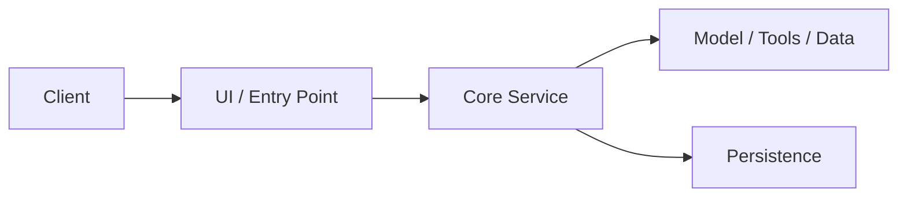

# Architecture Overview

## Repo / System Name

- System scope
- Audience
- Primary architectural question this deck answers

---

# System At A Glance

- Main components
- Primary users or callers
- Core responsibilities

---

# High-Level Flow

- Request enters through...
- Core processing happens in...
- State / persistence lives in...
- Output is delivered through...

---

# Major Components

- Component A: purpose
- Component B: purpose
- Component C: purpose

---

# Data And State

- What state is persisted
- Where context is stored
- How config or memory is handled

---

# Integration Points

- External APIs / model providers
- Auth boundaries
- Filesystem / storage access
- Deployment environment assumptions

---

# Key Tradeoffs

- Design choice and why it was made
- Constraints that shaped the architecture
- Known weak spots or complexity hotspots

---

# Recommended Improvements

- What to harden next
- What to simplify next
- What to scale next

