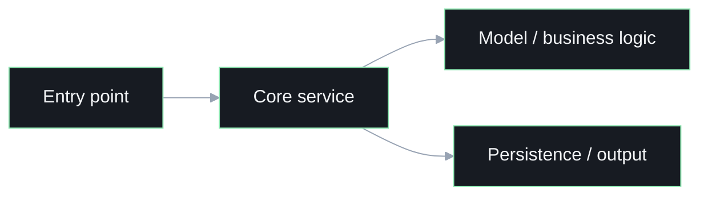

<!-- _class: lead -->

<div class="eyebrow">Technical Walkthrough</div>

# Project Technical Walkthrough

## Repo / Project Name

- what the project does
- who this walkthrough is for
- what the audience should understand by the end

---

# Why This Repo Exists

## Problem and purpose

- what problem the repo solves
- what workflow or user need it supports
- why the current structure matters

---

# Repo Shape

## Where the important logic lives

- main backend entrypoint or service layer
- UI surface or API boundary
- config / deployment / infrastructure files
- docs or guides that anchor the workflow

---

# Request Or Execution Flow

## How the system actually moves



---

# Important Modules

## The pieces that carry the most weight

- module 1: responsibility and why it matters
- module 2: responsibility and why it matters
- module 3: responsibility and why it matters

```ts
// Keep code samples short and specific.
// Show only the snippet that explains the architecture point.
```

---

# Local Development Flow

## How we work with it

- how to run it locally
- key environment or configuration assumptions
- the most common contributor loop

---

# Design Tradeoffs

## What is elegant vs what is messy

- key implementation tradeoff
- operational or UX risk
- where the design is still evolving

---

# What Should Happen Next

## Practical follow-up

- what to harden next
- what to simplify next
- where the roadmap should go from here
